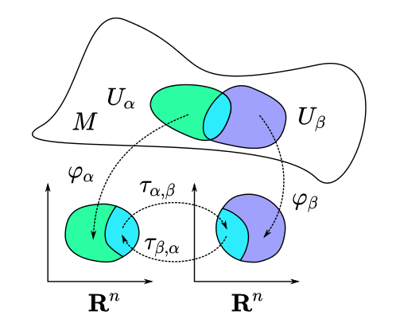

An **atlas** consists of [[chart]]s that describe regions of a [[topological manifold]]. For a topological space $M$, the atlas is a collection $\\{(U_\alpha, \varphi_\alpha) \vert \alpha \in A\\}$ such that $\bigcup_{\alpha \in A}U_\alpha = M$.

An [[atlas]] on a manifold is a set of charts whose domains cover the manifold completely.

# Type of Atlases

The maximal atlas contains all possible charts.

An atlas is $\heartsuit$-compatible if any two charts in it are $\heartsuit$-compatible.

Every atlas is $C^0$ atlas.

Ever $C^k$-atlas is uniquely smoothable to a $C^∞$-atlas.

# Transition Map

\begin{equation}
\tau_{\alpha,\beta} = \varphi_\beta \circ \varphi_{\alpha}^{-1}
\end{equation}

All three are [[homeomorphisms]].